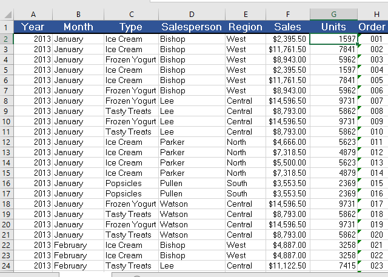
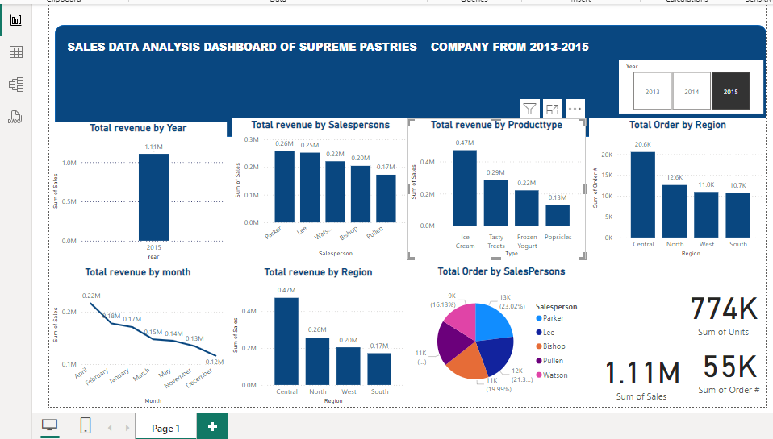

# Supreme-Pastries Sales-Analysis
### Introduction/Project Overview:
This dataset contains sales information for various frozen dessert products over a period spanning from December 2013 to January 2015. It, encompasses sales data of Supreme company for three years, specifically capturing monthly sales transactions categorized by product type, salesperson, region, sales amount, units sold, and order numbers. The primary focus of this dataset is on the sales performance of various frozen dessert products. This dataset was imported into Power BI for creating various visualizations and dashboards to gain actionable insights. The Power BI analysis will help in making data-driven decisions to improve sales strategies, optimize inventory, and enhance customer satisfaction, Key visualizations. This dataset will provide a clear and comprehensive understanding of the sales dynamics within the company, helping drive strategic initiatives and operational improvements.

### Data Sources:
Supreme Pastries Raw File.pbix. The primary  Dataset of this Project contained detailed transaction information of Supreme Pastries for three years, including Year of Transactions, Month of Transactions, Products Type, salespersons ,Regions ,Amount of sales , Units Sold and Order Numbers. The Data covers transactions for three years from 2013 to 2015.The dataset is a PowerB1 File by the company.

### Data Description:
The dataset contains sales data spanning from December 2013 to January 2015. The dataset is structured with multiple columns capturing various dimensions and measures necessary for comprehensive business intelligence and analysis in Power BI. Below is a detailed description of each column in the dataset: Year:  Indicates the year when the sales transaction occurred. The data spans from 2013 to 2015. Month:  Indicates the month of the sales transaction and this column captures the name of the month (e.g., January, February). Product: 
Represents the type of product sold. Products include Ice Cream, Popsicles, Frozen Yogurt, and Tasty Treats. Salespersons: this shows The name of the salesperson responsible for the transaction. Salespersons in the dataset include Bishop, Lee, Parker, Pullen, and Watson. Region Source: Indicates the geographical region where the sales occurred. The regions include North, South, Central, and West. Sales Amount:  The total sales amount for the transaction is in USD. This column captures the revenue generated from each sale. Units Sold: This indicate
the number of units sold in each transaction. Order Number: A unique identifier for each sales transaction.

### Skills/Concept:
#### Microsoft Excel Skills:
  -Data Creation and importing:
 - Data sorting and filtering.
 - Remove Duplicate
 - Text Function
#### Power BI skills:
-  import Data
-  Data Transformation
-  Column profile
-  column quality
-  column distribution
-  Data Validation and Analysis
-  Reports and Charts
- Cards
- Slicers
- Reporting and Dashboarding
-Dashboard Creation

### Analysis and Summaries With Tables:
1. Rows: Year
-  This analysis Showing Three years Transaction from 2013 to 2015'
2  Rows: Month
-  This showed the Months transactions were made.
3. Rows: Type
-  This analysis showed the type of Products sold.
4. Rows: Salespersons
-  This showed the number of persons that made sales.
5. Rows: Region
-  This showed the different regions sales transactions were made.
6. Rows: Sales
-  This analysis showed the amount of sales.
7. Rows: Unit
-  This showed the number of unit sold.
8. Rows: OrderNumber
-  This analysis showed the number of times the orders were made.

 
  
### Visualization/ Dashboard: 

### Results and Findings:
-The dataset of Supreme-Pastries showed a great trend. Sales figures from the West region (primarily by Bishop) are dominant.
 Multiple sales entries by Bishop, particularly for "Ice Cream" and "Frozen Yogurt," with total sales figures like $2,395.50, 
 $11,761.50, and $8,943.00.
 Other regions such as Central and North (sales by Parker) also show significant sales, e.g., $14,596.50 for "Frozen 
 Yogurt" and $9,731.50 for "Tasty Treats". Lee also shows a strong sales in the Central region for "Tasty Treats." 
- The data shows the sales performance by product type. The Ice creame made the highest sales, followed by frozen yourght. The least 
 sales were made by Popsicles.
- From the dataset, the salesperson that generated the highest sales is parker, followed by Lee then Watson.
-  From the dataset, the reginal sales performance is high in the the central, follwed by North, west then south made least sales.
-  From  sales overtime, Apil appears to be a stronger month overall, with multiple high-value sales entries.
   February follwed with strong figures too, especially from Central region.
-  The total units of products sold is seven hundred and seventy four thousand.
  
 ## Summary and Trend Analysis:
Top Performer: Parker is the leading salesperson in terms of total sales.
Product Performance: "Ice Cream" and "Frozen Yogurt" are the most sold items, with "Tasty Treats" also showing strong sales.
Regional Analysis: The Central and North regions are the most profitable, with the Central region showing significant sales.
Trend: April has higher sales volume compared to February, but both months show strong performance in the regions.

## Recommendations
Focus on High-Performing Regions and Products: Suggest allocating more resources to the high-performing regions and products to maximize profits.
Salesperson Training: If certain salespersons are underperforming, recommend further training or reassessment of their strategies.
Inventory Management: If certain products are not selling well, consider optimizing inventory to reduce costs.
Monitor monthly sales trends to identify peak sales periods.
Analyze the performance of different product categories and regions to allocate resources effectively.
Identify top-performing salespersons and regions to recognize and replicate successful strategies.
Customer Insights:
Use the data to identify high-value customers and tailor marketing efforts accordingly.
Analyze return rates and customer feedback to improve product offerings.
Utilize historical sales data to forecast future sales and set realistic targets.
Implement predictive analytics to anticipate market trends and adjust strategies proactively for
Continuous Improvement.

 
 
  
  
  
  
  
  
 

